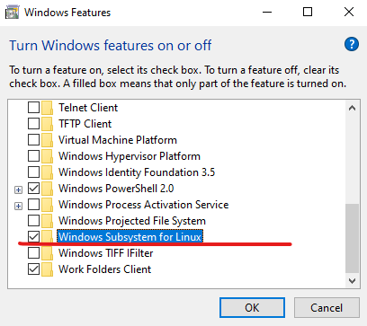

# Introduction 
Perform the following steps to install the Linux subsystem and run the Snowflake CSV uploader.

# WSL Installation and Git Configuration
1.	Install Ubuntu from Microsoft Store: https://www.microsoft.com/store/productId/9NBLGGH4MSV6
2.	Install Microsoft Terminal: https://www.microsoft.com/store/productId/9N0DX20HK701
3.  Search Start menu for "Turn Windows features on and off"
4.  Enable "Windows Subsystem for Linux" click OK and reboot when prompted: 
 
5.  Search for Ubuntu from Start menu and run to begin installation
6.  Enter Username and Password when prompted (won't change with LOL password updates)
7.  Close window after completion
8.  Open Windows Terminal
9.  Change default shell to Ubuntu: 
 
 
10.  Open new terminal tab to activate Ubuntu shell
11.  Run following command to download Miniconda installer: `wget https://repo.anaconda.com/miniconda/Miniconda3-py39_4.11.0-Linux-x86_64.sh -O install-miniconda.sh`
12.  Follow prompts and select defaults except for when the installer asks whether you'd like to initialize at the end. Select `Y`.
